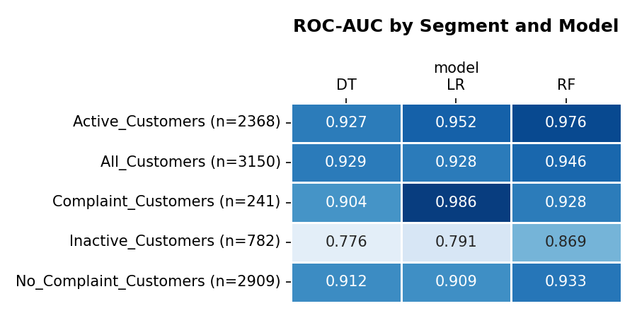
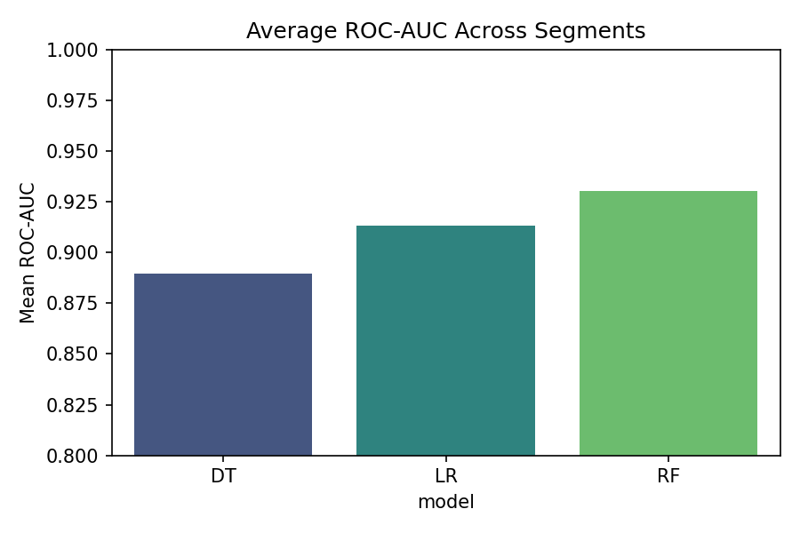
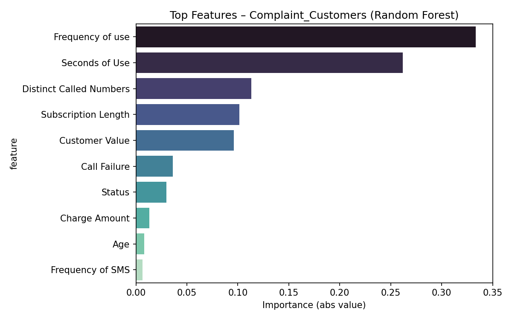

# Telecom Customer Churn Prediction

## Project Overview
The purpose of this project was to act as a data analyst for a telecom provider (referred to here as **TC**) to evaluate customer churn risk. The business objective was twofold:  
1. Predict which customers are most likely to churn.  
2. Understand the drivers of churn across different customer segments in order to shape retention strategies.  

To achieve this, multiple modeling approaches were tested and compared:  
- Logistic Regression  
- Decision Trees  
- Random Forests  

The models were applied across several customer groups: Active customers, Inactive customers, Complaint vs. No Complaint customers, and the entire customer base.

---

## Key Insights

### Model Performance
- **Random Forests delivered the strongest performance overall**, achieving the highest ROC-AUC across most customer segments, particularly for Active (0.976), Inactive (0.869), and No Complaint customers (0.933).  
- **Logistic Regression outperformed other models for Complaint Customers**, with a ROC-AUC of 0.986, suggesting complaints provide a strong linear signal for churn.  
- Decision Trees offered the weakest performance but provided interpretability useful for business explanations.  

**ROC-AUC by Segment and Model**  


**Average ROC-AUC Across Segments**  


---

### Feature Drivers
- **Status and complaints**: When looking at all customers, these are the top two predictors of churn.  
- **Usage intensity** (Seconds of Use, Frequency of Use, Distinct Numbers) consistently ranked as top predictors across groups.  
- **Customer value and payments** (Charge Amount, Customer Value) were critical for distinguishing higher-risk accounts.  
- **How segmentation affected predictors**:  
  - **Inactive Users**: *Complaints* followed by *Usage Intensity* are the strongest predictors.  
  - **Active Users**: *Usage Intensity* followed by *Complaints* are the strongest predictors.  
  - **Users with Complaints**: *Usage Intensity* followed by *Customer Value* are the strongest predictors.  
  - **Users without Complaints**: *Status* followed by *Customer Value* are the strongest predictors.  

**Example: Top Features – Complaint Customers**  


---

## Strategic Recommendations
1. **Targeted retention campaigns**  
   Use churn scores from the Random Forest model to identify high-risk Active and Inactive customers. Offer incentives (discounts, plan upgrades) to customers showing declining usage intensity or frequent call failures.  

2. **Complaint management**  
   Since complaints are a dominant churn driver, prioritize rapid resolution. Establish proactive outreach to customers who file complaints to prevent disengagement.  

3. **Data-driven segmentation**  
   Apply segment-specific strategies: optimize for usage and engagement among No Complaint customers, but address service quality issues for Complaint customers.  

---

## Deliverables to TC
- A Tablue Dashboard to assist marketers
- **Dashboard**

- A **multi-page PDF dashboard** summarizing model performance, ROC-AUC comparisons, and feature importance by segment:  
  [Download Comparison Report](graphics/Reports/comparison_report.pdf)  
- Individual plots for quick reference, including heatmaps of model performance and segment-level feature importance rankings.  
- A structured dataset of metrics and feature importances to enable ongoing monitoring and further analysis.  

---

## Repository Structure
```
├── data/ # Customer churn dataset
├── graphics/ # Visualizations and reports
│ ├── comparisons/ # Segment/model comparison plots
│ ├── Reports/ # PDF dashboards and CSV outputs
│ ├── Active_Customers/ # Plots for Active Customers segment
│ ├── Inactive_Customers/ # Plots for Inactive Customers segment
│ ├── Complaint_Customers/ # Plots for Complaint Customers segment
│ └── No_Complaint_Customers/ # Plots for No Complaint Customers segment
├── data_clean.py # Organizes, and creates a pipeline for data_set
├── main.py # Creates model, records metrics, and creates graphics
├── README.md # Project overview & insights
└── requirements.txt 
```